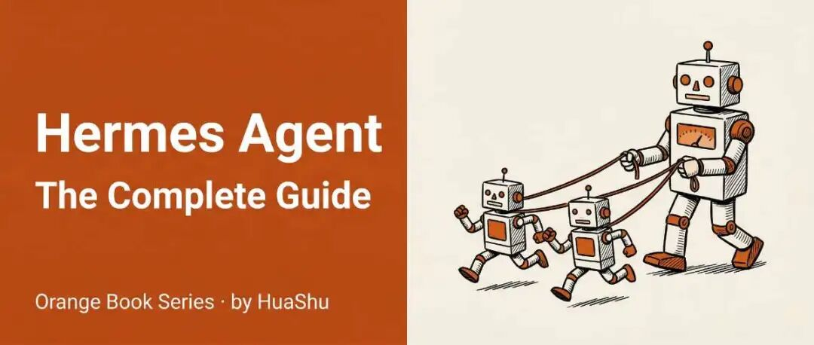
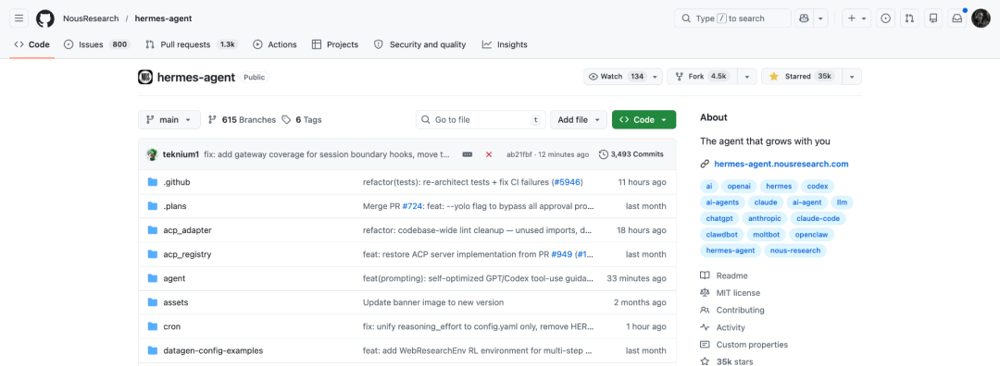
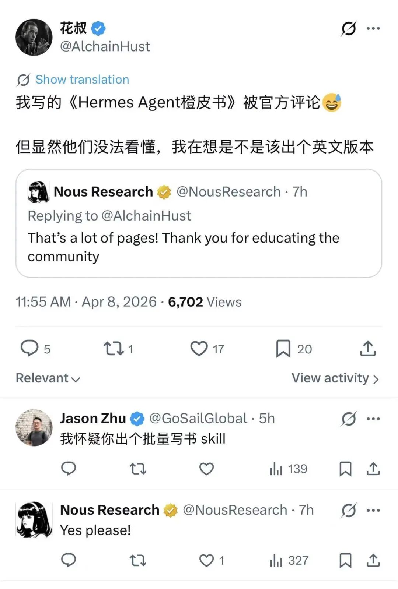
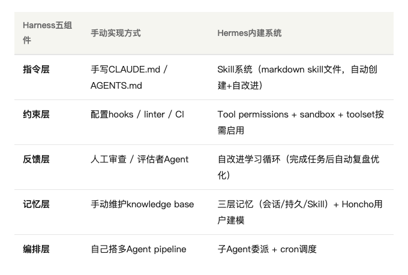
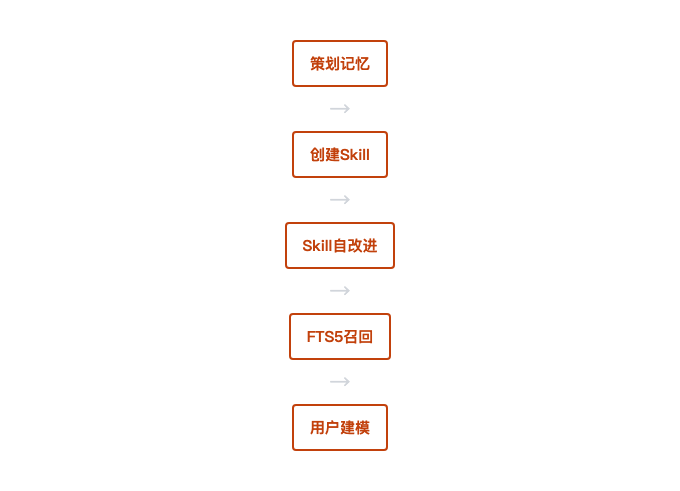
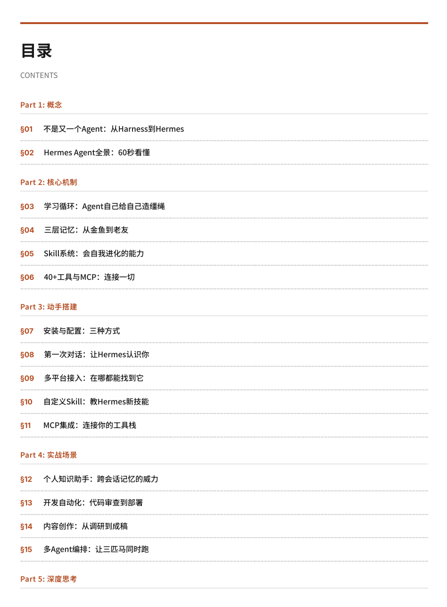
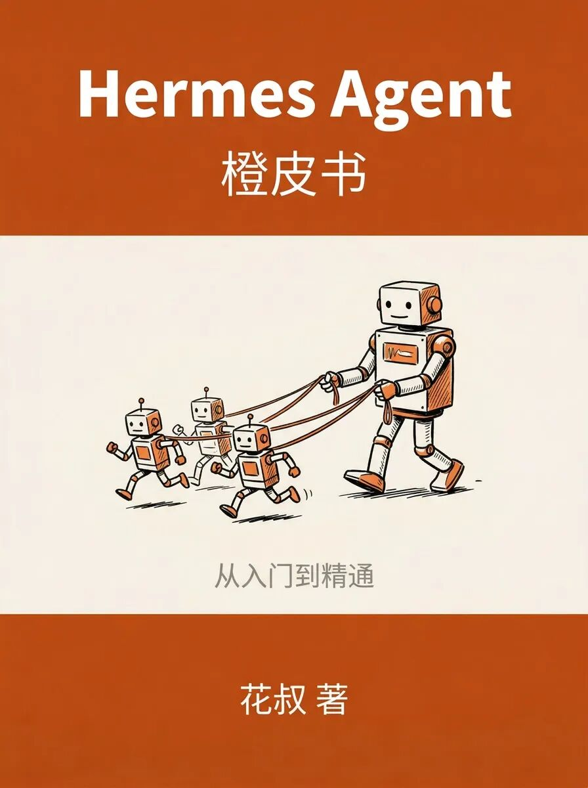
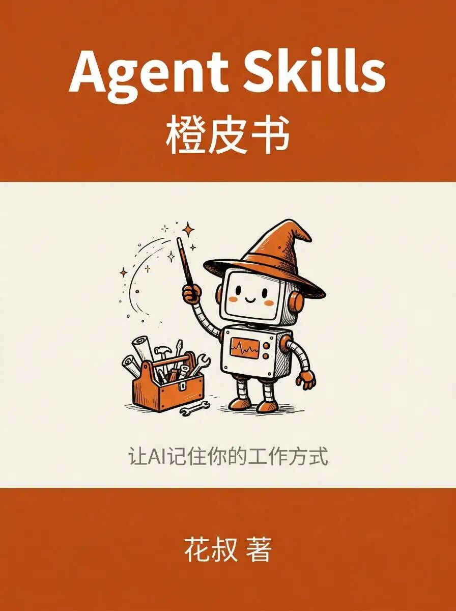
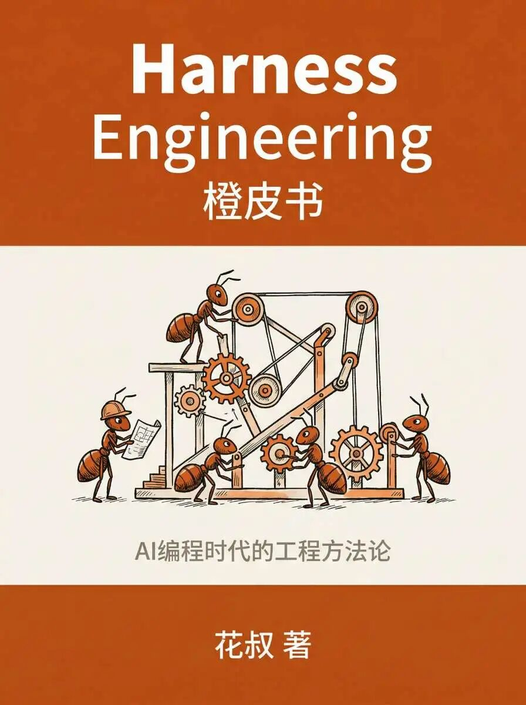
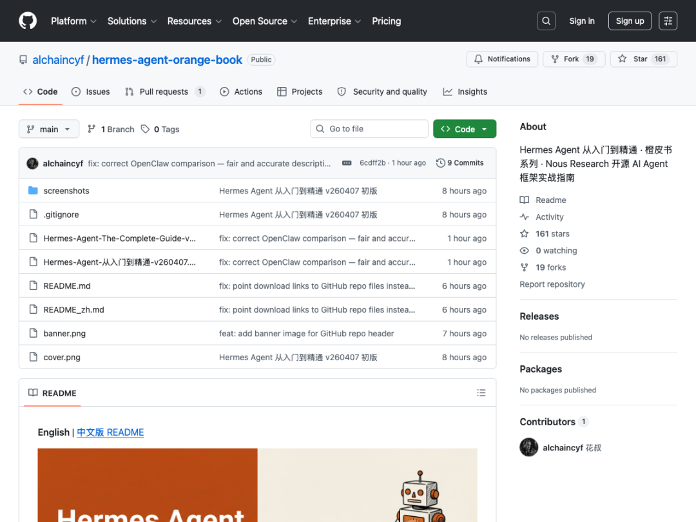

# 年轻人的第一个爱马仕

**作者**: 花叔

**来源**: https://mp.weixin.qq.com/s/M45QH0PnShWMiOy-pdSuTQ

---

Hermes这个词，在不同圈子里有完全不同的含义。

时尚界听到Hermes，想到的是铂金包、丝巾、一年等三年的配货制度。AI圈听到Hermes，想到的是Nous Research搞的那个开源Agent框架。GitHub上35000多颗星，上线不到两个月，社区里已经有人喊它「OpenClaw之后最值得关注的Agent」了。

两个Hermes唯一的共同点：都不便宜。一个要你的钱包，一个要你的时间。

区别在于，爱马仕你得配货三年才能买到铂金包。Hermes Agent你得配置三小时才能跑通第一个对话。

不过今天这个Hermes，免费。而且我帮你把配置过程写清楚了。

## 我写了本76页的使用手册，官方说看不懂

事情是这样的。

我前阵子花了些时间研究Hermes Agent。研究着研究着就觉得，这东西的设计思路很有意思，但中文资料几乎为零。官方文档是英文的，社区讨论也主要在Discord和X上，国内想用的人基本靠自己摸索。

于是我做了一件我最擅长的事：写橙皮书。

这是橙皮书系列的第7本了。从Claude Code到Harness Engineering到OpenClaw，每次遇到一个我觉得「值得系统讲清楚」的东西，就会写一本。不是翻译文档，是把整个框架拆开，用人话重新讲一遍。

《Hermes Agent从入门到精通》，17章，76页，覆盖了从「这是什么」到「怎么装」到「能干嘛」到「边界在哪」的完整路径。

写完发到X上，Nous Research官方账号回了一句：

> That's a lot of pages! Thank you for educating the community

翻译：好多页啊！谢谢你教育社区。

听着挺感动的对吧？但后半句才是重点。**他们看不懂中文。**

一个开源项目的官方团队，看着有人写了76页关于他们产品的指南，激动地点了赞，但一个字都读不懂。这画面本身就很Hermes。神的信使嘛，传话传了，语言不通。

所以我又做了一个英文版。17章重新翻译一遍，就为了让官方能看懂我在夸他们。

这大概是内容创作者最卑微的时刻：写了篇万字好评，甲方说「谢谢，但我不识字」。

## 为什么是Hermes，不是又一只龙虾

我3月写过「龙虾纪元」，很多人问我：既然OpenClaw那么火，为什么还要关注别的Agent？

因为它们解决的是不同的问题。

OpenClaw的核心是「养虾」。你给它写soul.md，教它认识你，看着它一天天变聪明。更像一个你精心培养的私人助理。

**Hermes Agent的核心是「自进化」。**你不用手动教它，它自己会学。

上一本橙皮书写的是Harness Engineering，讲怎么给AI搭缰绳。指令层、约束层、反馈层、记忆层、编排层，五件套。那本书的潜台词是：AI很强，但你得亲手建一套控制系统才能用好它。

Hermes Agent做了一件事：**把缰绳焊进了出厂设置，而且缰绳会自己长。**

它有一个学习循环。你用着用着，它自己会把做过的事提炼成Skill（就是markdown文件），下次遇到类似任务直接调用。做得不好？它从你的反馈里自己改。**用得越久越顺手，但不是因为你在调教它，是它在调教自己。**

记忆分三层。会话记忆记「发生了什么」，持久记忆记「你是谁」，Skill记忆记「怎么做事」。跨会话不失忆，你上周聊的东西它这周还记得。

40多个内置工具，15个平台接入（Telegram、Discord、Slack、微信都有），MCP支持6000多个应用。

**最离谱的是部署成本。**一台5美元的VPS就能跑，内存占用不到500MB。

**爱马仕的包要几万块起步。这个Hermes，5美元。**

年轻人的第一个爱马仕，名不虚传。而且不用配货。

## 橙皮书里写了什么

17章分五个部分，简单说一下。

前两章讲概念。Hermes和OpenClaw、Claude Code是什么关系？**不是替代，是递进。**三者分别解决不同阶段的问题。

中间四章是技术密度最高的部分。学习循环怎么跑的、三层记忆怎么设计的、Skill系统怎么自我进化的、40多个工具怎么按需启用。这部分是Hermes和其他Agent真正拉开差距的地方。

然后五章动手搭建。三种安装方式、第一次对话、多平台接入、自定义Skill、MCP集成。从零开始，不需要会写代码。

四章实战场景。个人知识助手、开发自动化、内容创作、多Agent编排。每个场景都有操作路径和我自己的使用经验。其中内容创作那章，我基本是在用Hermes写关于Hermes的内容，有一种照着镜子画自画像的荒诞感。

最后两章是深度思考。三个Agent框架的横向对比，以及自改进Agent的边界问题。它能走多远？需要走多远？谁来看着它？

**最后一章留了四个开放问题。我没给答案，因为我自己也还在想。**

## 不敢开源的东西

说个题外话。

有人在X上问我，橙皮书是怎么写的，能不能开源写作流程。

我回了一句：和Anthropic不敢开源他们的最新模型一样，我也不敢开源我的橙皮书Skill。

但「能写出来」和「写得好」之间的差距，恰好是这本书想讨论的核心问题。

Hermes Agent的学习循环也是同一个道理。它能自己创建Skill、自己改进Skill，听起来很酷。但最好的状态是：**让它在「怎么做」上自改进，人管「做什么」和「别做什么」。**

工具越强，人的判断越重要。我在每一本橙皮书里都在写这句话。写到第7本了，还是这句。

## 在哪看

GitHub上免费下载，中英文PDF都有：

github.com/alchaincyf/hermes-agent-orange-book

这是橙皮书系列第7本。前面6本（Claude Code入门、Claude Code源码解析、Harness Engineering、Agent Skills、OpenClaw、Polymarket）都已经在或即将在微信读书上架了。

说真的，写到第7本的时候，我有时候会怀疑自己是不是对「免费写76页手册」这件事上瘾了。

但每次写完，在公众号后台或微信读书评论区收到一条「这本书帮我理解了XXX」的私信，就觉得挺值的。

哪怕Nous Research的人一个字都看不懂。没关系，英文版已经发了。下次他们要是回复「Still too many pages」，我考虑出个漫画版。
