# 【猪杂谈】二十四桥谱广陵，平江河街画姑苏

**作者**: 小朱哥

**来源**: https://mp.weixin.qq.com/s/0_9TTHw3aPeUeVhEWsdLfg

---

1

万万没想到，连放个春假，网上都有无数人吐槽。

这个世界上有那么一种人，他们对任何事情都不满意，无论碰到什么样的安排，他们都觉得自己的利益受到了损害。以前娃儿周末和假期补课，他们就说教育太卷了，现在放个春假，他们又说这个学期本来就短，为什么不在教室里学习。

今天你晚上煮的面，他就说想吃饭，明天你做好了饭，他就说想吃面，后天你面和饭都给他准备好了，他又说为什么没蒸馒头，你和他说得清楚个毛线。

2

很多人都说，自己要上班、要挣钱，孩子放假没人管，只能在家里看电视刷手机。这种人多数就算是给他放假，除了骂骂咧咧的催作业以外，通常其实也不怎么会管孩子，绝大多数一放假只会埋头刷手机的娃，都有一对下班只会埋头刷手机的爹妈。

就算早上出门晚上回家，一天上10个小时的班，安排孩子两天假期，也没有任何难度：

——很多学生都有自己的课外兴趣班，这两天让他们多上两节课，画画写字弹琴打球，不就差不多过了吗？

——如果没有兴趣班，外面有很多假期的儿童营，骑车、徒步、采摘……一大早送过去晚上接回来，孩子在户外和小朋友疯一天，太阳晒够氧吸够，这些鸟人以前不老是抱怨孩子没有户外活动的时间吗？现在时间来了，他还是骂骂咧咧。

——如果没有兴趣班、也不想花钱参加这些儿童营，你让孩子睡个懒觉、下楼和小区的同学玩半天，回来看部动画片，开开心心的一天不也过了，需要你安排什么？有些爹妈就是见不得自家孩子享受一下生活，哪怕只是睡两天懒觉，只要孩子一闲下来他就觉得在浪费时间，就开始焦虑，你生的是一个人，不是一头驴。

3

今天吐槽放假时间多的，和之前抱怨孩子在校时间长的，其实是同样一群人，无论在社会上、在单位里、在家里……他们都没啥价值和存在感，但他们坚定的认为这个家缺了他们就莫法转，他们抱怨一切，反对一切，虽然所有的抱怨和反对都没有任何作用，他们依然坚持，从成年一直到死。

网上一堆人，拿着同一套文案，对着摄像头和春假喷口水，这些人百分之九十以上都是头发凌乱、皮肤暗沉、满脸戾气、衣衫不整，下面留言几十到上千条不等，赞同附和的，百分之九十以上和他们都是一样的人。

这些人虽然还能喘几十年气，但事实上已经没有救了，这本来没啥，但他们的孩子是真可怜，令人同情。

4

从去年有城市开始试点放春假开始，我就盘算着如果假期落在我们头上，我一定带孩子去趟江南。

一方面是他今后接触的诗词、文言文、小说……江南都会高频的出现。“草色遥看近却无”、“江山柳如烟，雁飞残月天”、“春水碧于天，画船听雨眠”、“一叶舟轻，双桨鸿惊，鱼翻藻鉴，鹭点烟汀”、“半壕春水一城花，烟雨暗千家”……关于江南这种水平的诗词，至少有大几千首，把与之风格冰火两重天的边塞诗加上，估计上万首，挑个几百首出来配上音乐和画面、结合这些诗词背后的故事，一个温婉一个苍凉，带孩子们走两圈，我不相信他们会不喜欢，会没有文化自豪感，如果我70岁的时候找不到事干，我就开个班来讲这个。但反过头看看我们的中小学语文课本，有些内容，都是些啥弱智玩意，算了不吐槽了，再吐槽我就和前面被我吐槽的那些差不多了。

之所以想赶在春天，除了风景以外，还有一个很重要的原因就是天气，浙江江苏和重庆差球不多，七八月份都不是人待的。

所以老师在群里宣布春假日期之后，不到20分钟，罗西西就已经把机票酒店定好了，扬州加苏州，充分体现了一种蓄谋已久和急不可待的状态。

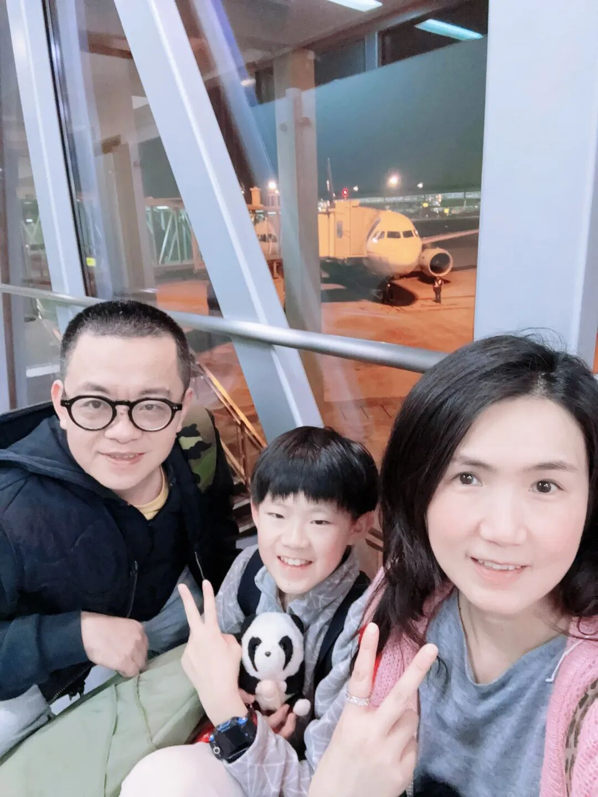

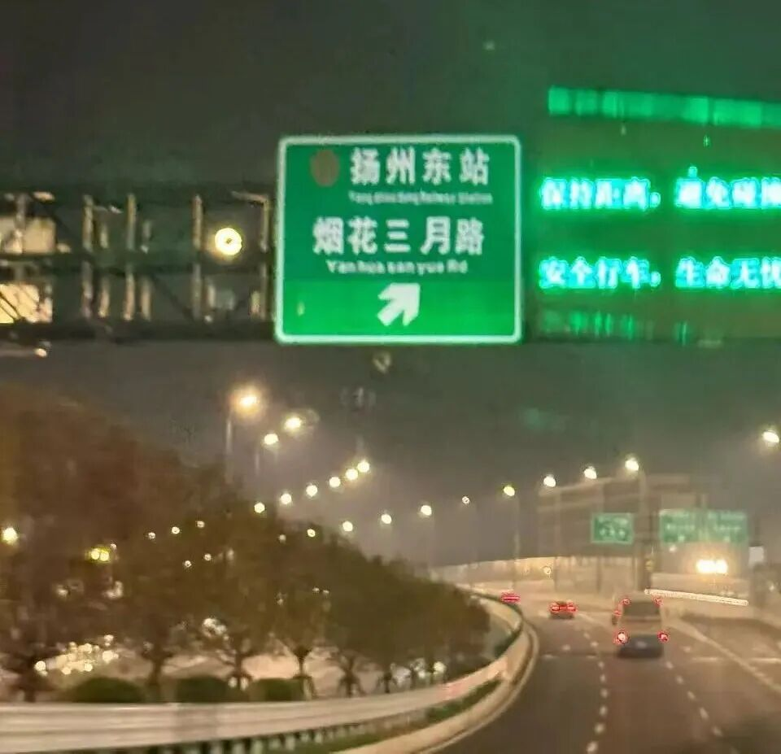

5

江南的春天很漂亮，但五天走下来，给我印象更深的是人。

6

从一个家族故事聊起。

有一个人，他的父亲是进士，进过翰林院，他的儿子也是进士，也进过翰林院。

他49岁辞官，回家陪了老母亲17年，顺便造了个名园，然后66岁去到上海，投资实业。

他的两个孙子，都是密歇根大学的法学博士，其中一个当过孙中山的律师，然后两兄弟一起办了一个持志大学，这所民办大学的学生里，有傅雷、有金庸，还有至少五六个学生，成就一点不比傅雷金庸低，只是名字不为大众所知。

他的另一个孙子是知名画家，曾孙女也是知名画家。

他的一名曾孙是理论物理学家，一名曾外孙女是原子弹专家，两人都是中科院院士。

他给自己的园子取了个名字叫寄啸山庄，他就是何园园主、寄啸山庄庄主：何芷舠。

何园并不是苏杨众多园子里最精致的，罗西西甚至说它和其他园子比起来太过朴素，但我选了它做第一站，就是因为它里面饱满的家族故事，和这方园子孕育的一个个值得回味的人。

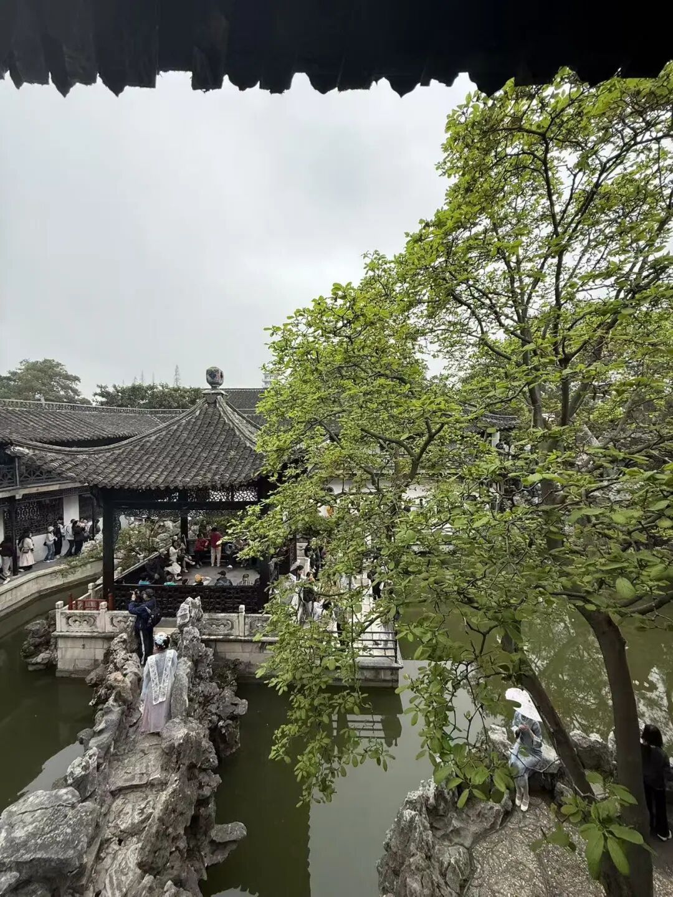

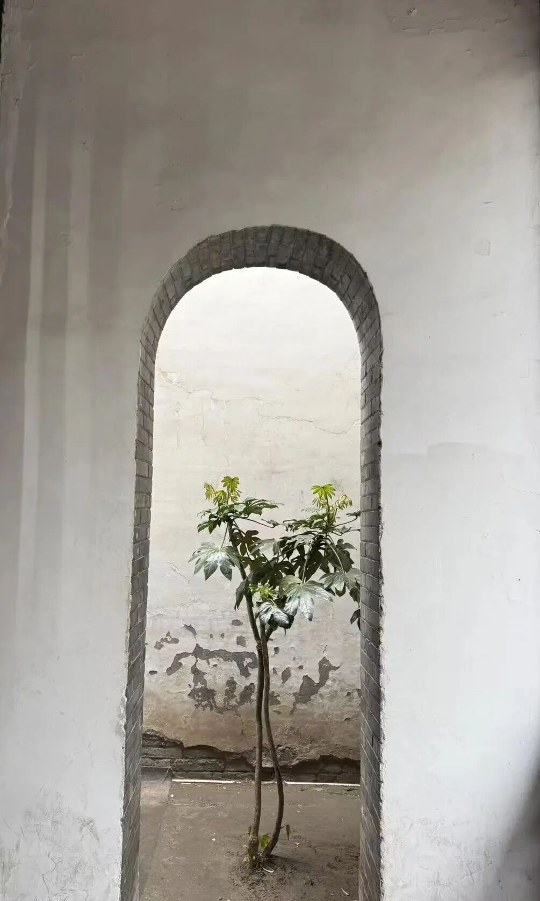

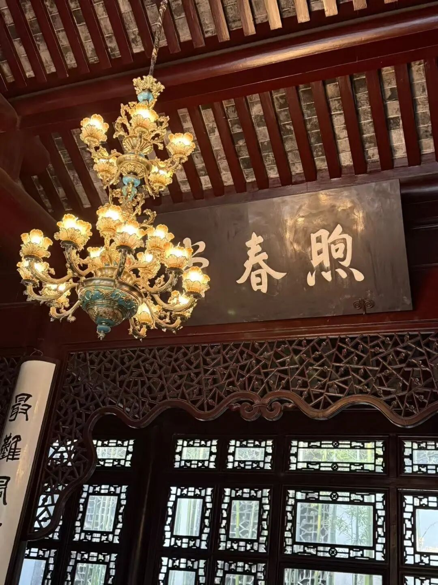

我查了一下，清代114名状元，江苏占了49个，一省独占约四成。

截止2025年12月，我们国家总共诞生了1910位院士（含已故），江苏独占528名，在各省份中，同样是断档领先。

苏州这样一个连机场都没有的非省会城市，2025年GDP2.77万亿，比山西贵州都高，是甘肃的两倍，海南的三倍多。

整个扬州，三区一县、再加两个代管县级市，城镇人口也只有300多万，但它有山姆有盒马，并且国内购物中心天花板德基，接下来和扬州有深度合作，除了开卖场以外，还包括艺术馆和博物馆，这其实也是我个人一直以来很期待的一件事，那就是好的商业品牌、成熟的商业企业，深度参与城市公共空间打造和运营：大剧院、体育馆、博物馆、艺术馆、文创园、各种城市更新……，我相信无论是功能定位、规划设计、软件配套、营销包装、还是日常运营，都和单纯以行政单位为主导，会有很多不同，比如南京的德基、成都的万华、北方的阿那亚等等，我觉得都有这个能力和潜力，如果这个口子打开，按照中国人的聪明和内卷程度，在这个领域大概率还会出现比德基万华阿那亚更好的企业，所以扬州和德基合作的艺术馆和博物院开业后，我一定会专门跑一趟，仔仔细细的看一遍。

8

这里顺便想举个反面的例子，那就是现在的各种文创园，重庆也好其它城市也罢，总是让一些所谓的本土文化人，什么媒体人、广告人、本土野生作家诗人之类，过多过深的，参与这些文创园的设计和运营，因为想当然的觉得，这些人是文化人，又在本地生活最懂本土文化，所以让他们参与这些事好像很合适，但事实上这些老逼登，大多数通常只会干三件事：喝酒、吹牛逼、睡女粉丝，你给他们一张超过三页的报表，90%以上都看不明白，所以现在的各种文创园，死掉的占一半，要死不活的又占接近一半，不是资源不好没有机会，归根到底是人不行，再具体一点，就是各个城市的文艺老逼登都不行，没有例外，他们首先抱团成一个小圈子，找到一种集体优越感，觉得自己比大众高级，然后再在这个小圈子里相互拉踩、暗自较劲。

所以江苏这种地方，一个很大的优点就在于，你会发现一些你设想的东西，它已经或是正在变成现实，这个和经济有关系，但不是绝对的。要说搞钱福建人也很厉害，在很多领域甚至比江苏人更厉害，但你很难指望福建人来引领城市文化和公共空间营造。

9

于是一个问题自然就冒出来了：为什么是江苏？

我个人觉得，里面至少有两个原因，一个是地利，一个是人。

10

在河运时期，扬州绝对是东方之珠，它是长江和大运河这两条河运动脉的交集，向东还可以出海，今天的上海是什么地位，之前的扬州就是什么地位。

再来看人：

西晋末年永嘉南渡，中原士族来了一大批。

因为大运河开通，苏州扬州成了顶级文人的互动平台：李白孟浩然多次沿运河南下扬州，白居易当过苏州刺史、他和刘禹锡第一次奔现是在扬州，杜牧是淮南节度使的幕僚，苏东坡经常跑到苏州来搞串联……文脉从来不是一天建成的。

靖康之变后南宋初年，北方文人又来了一大批。

明代中期，扬州淮安的盐业兴起，又让它成了徽商和晋商的主场。

顶级文人的互动平台，加上几大波精华移民涌入，才成就了今天的江苏。

11

海运和铁路成为主流后，在经济地位上苏州和扬州被降级了，它们可能永远再也无法成为商业和文化的中心，但那几批精华移民的遗传基因，和顶级文人一句一句堆砌起来的文脉，让它注定会成为一种特殊的存在，何园家族的故事、两院院士的数量，都是这种特殊性的镜像。

这种特殊，在很多细微处随地可见。大运河博物馆的3号馆，复刻了一条古风的商业街，整个馆就是一个卖场，你可以吃点心、喝奶茶、买各种东西，商业街正中是一个戏台，有演员在上面唱戏，街上是密密麻麻的人群各种吃喝逛买，有那么一些瞬间我感觉自己完全不是在逛博物馆，文创店现在是每个博物馆的标配，但这种做一整条商业街让观众沉浸式体验的，我还是第一次见，可能有些老学究老文化人会觉得这太儿戏，但这有什么关系？人民群众喜欢、你算老几？罗西西和我儿子就很喜欢，逛得流连忘返，罗西西在一家珐琅局逛手镯，我一看价格最高的也只要400，直接说别看那些几十百八块的，只在最贵的那一盒里面选，逛个博物馆还逛出了霸道穷裁的情绪价值，有什么不好？

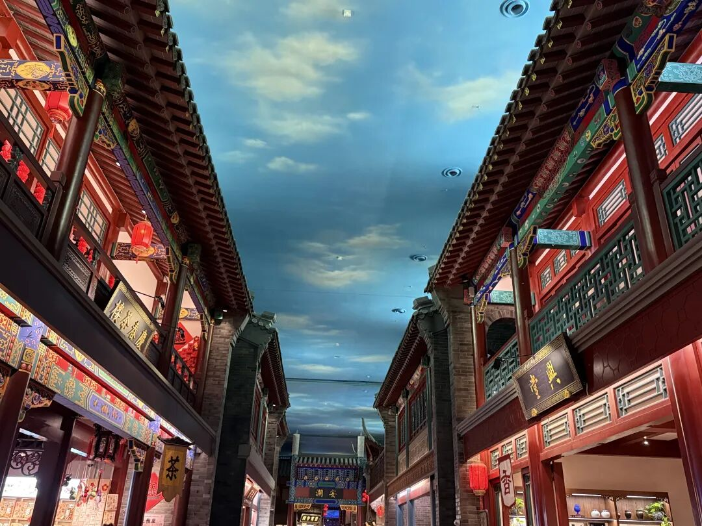

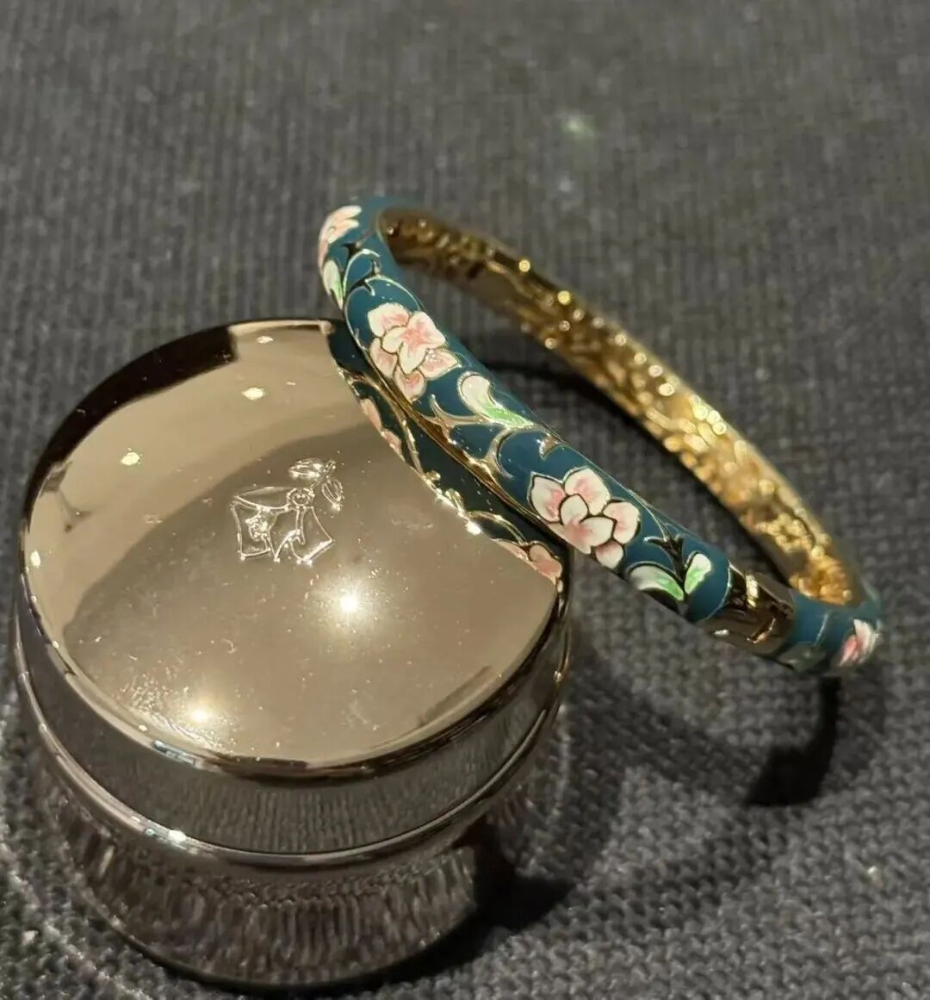

一个被老逼登思维掌控的城市，是吸引不到年轻人的，没有年轻人的城市没有未来。我在扬州和苏州的街道上，看到的年轻人比例，明显高于同行政级别的其它城市，有两三个网约车司机都给我聊过，就算是平时他们生意也不错，还有一个年轻的司机说，他身边的朋友找工作普遍都不太困难。

12

因为要跑两个城市、还留了一天给古镇，所以这次在苏州市区停留的时间，严格来说只有一整天，我儿子是第一次去苏州，所以我安排的是白天平江路、晚上金鸡湖，白天看最老的姑苏，晚上看最现代的苏州，完了之后罗西西发了个朋友圈，九宫格里新老苏州差不多各占一半，无论是维护老的、还是建设新的，苏州人都表现得游刃有余，张弛有度收放自如，什么叫有文化？这就是，在很多其它城市，我们看到更多的，是用力过猛和参差不齐。

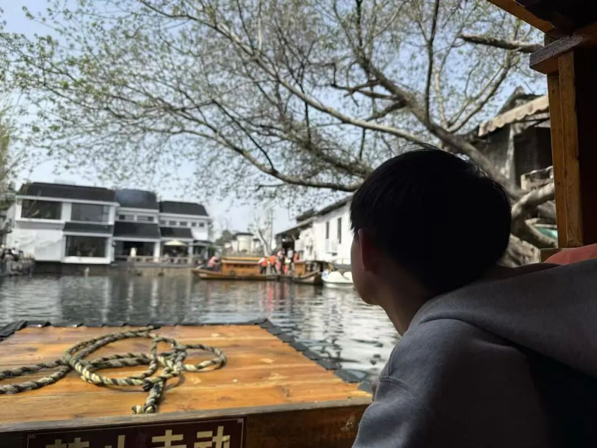

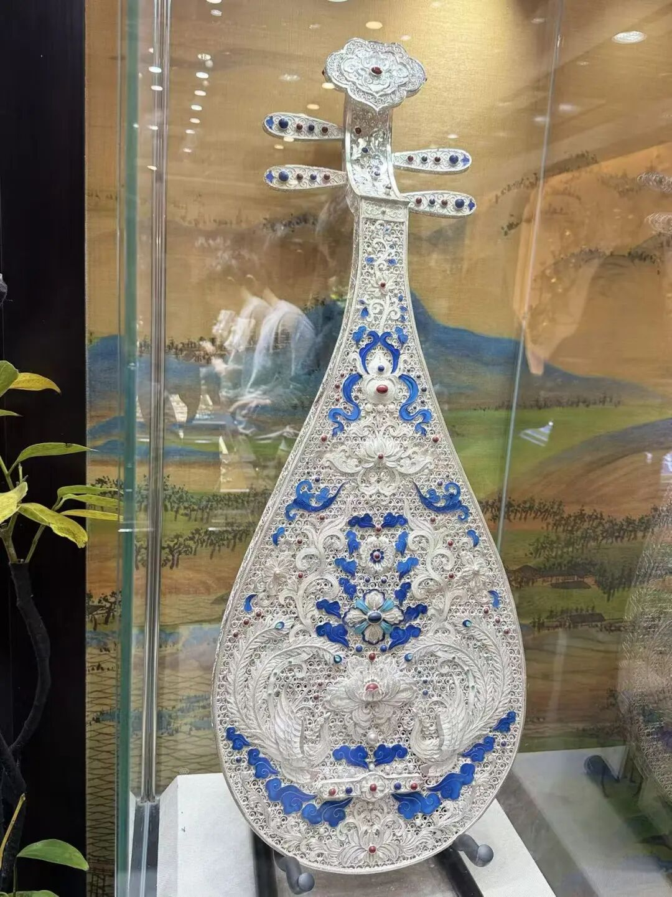

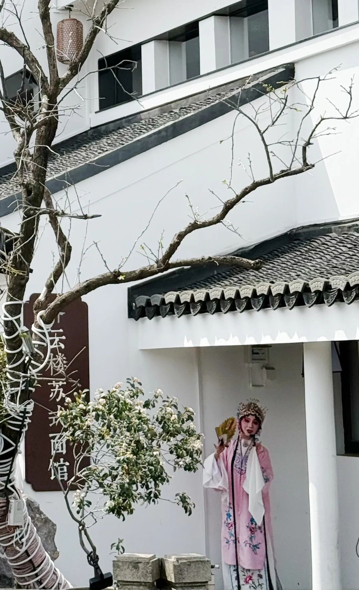

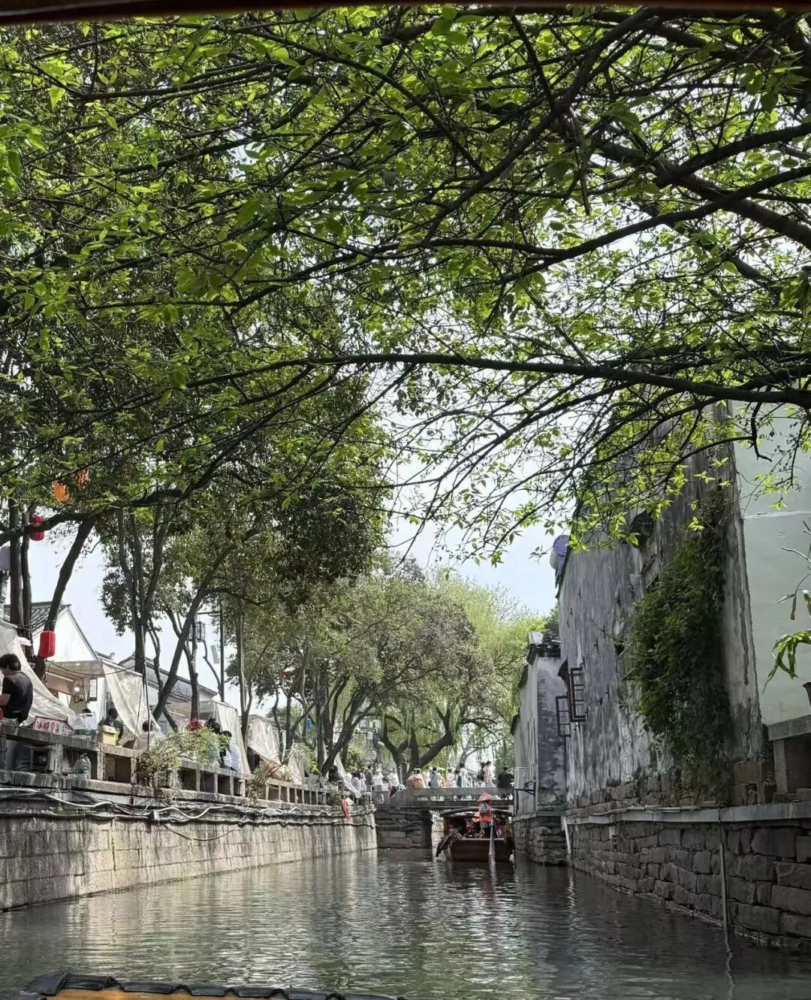

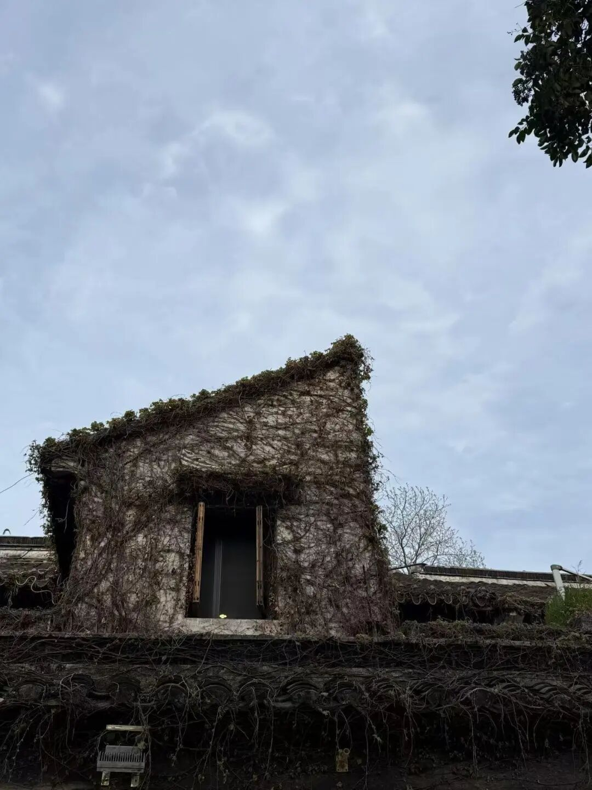

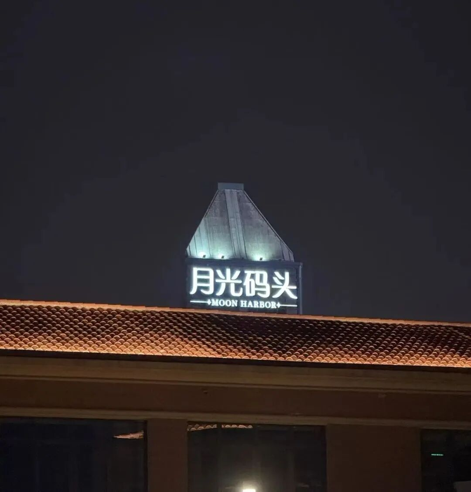

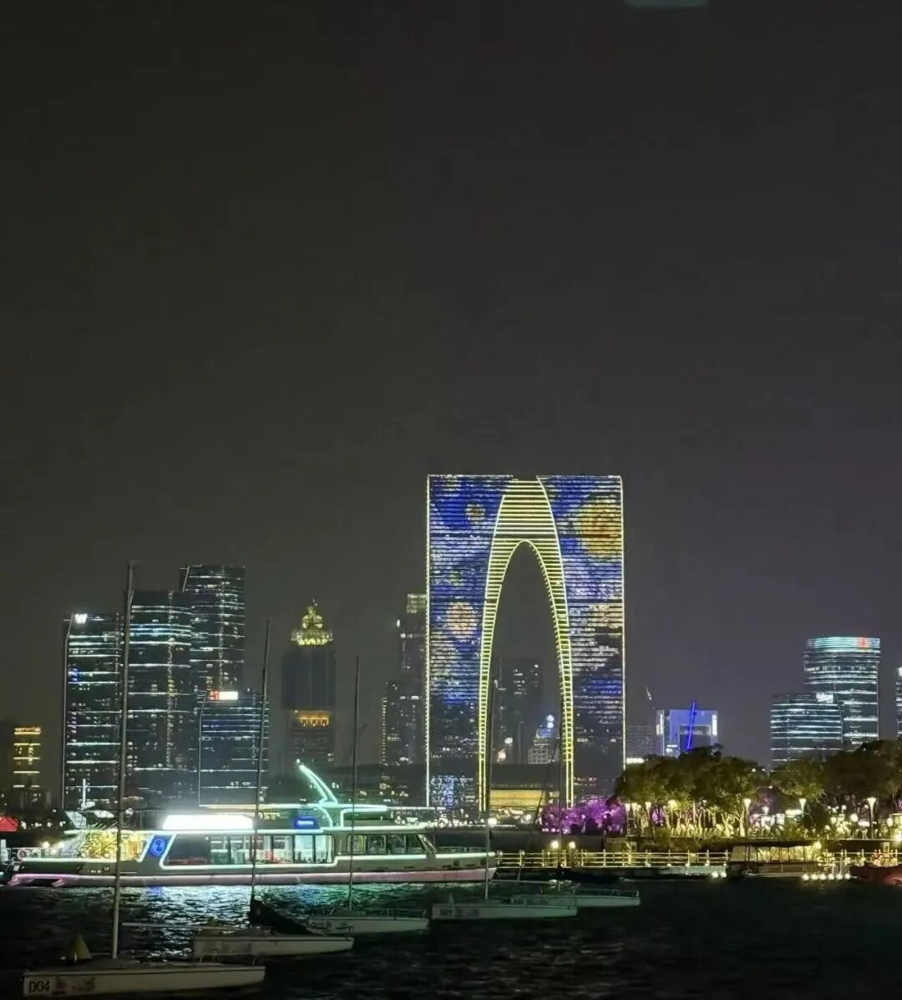

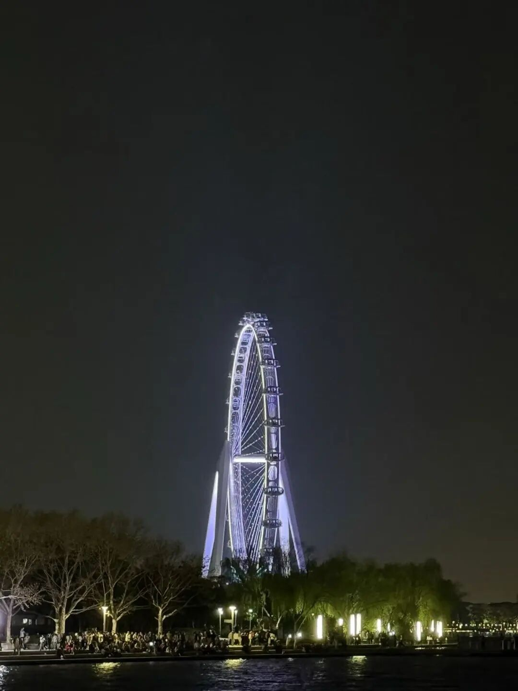

眼睛能看到的、手机能拍到的，只有小桥流水，亭台楼榭，二十四桥谱广陵，平江河街画姑苏。

但谱广陵画姑苏的，是一个又一个的人，永嘉南渡之后、白居易刘禹锡杜牧之后，是江南四大才子扬州八怪，张謇何芷舠钱钟书，胡乔木华罗庚茅以升费孝通贝聿铭，曹雪芹梅兰芳徐悲鸿……

这复制不了，甚至学都很难学得来，因为那是一代又一代。

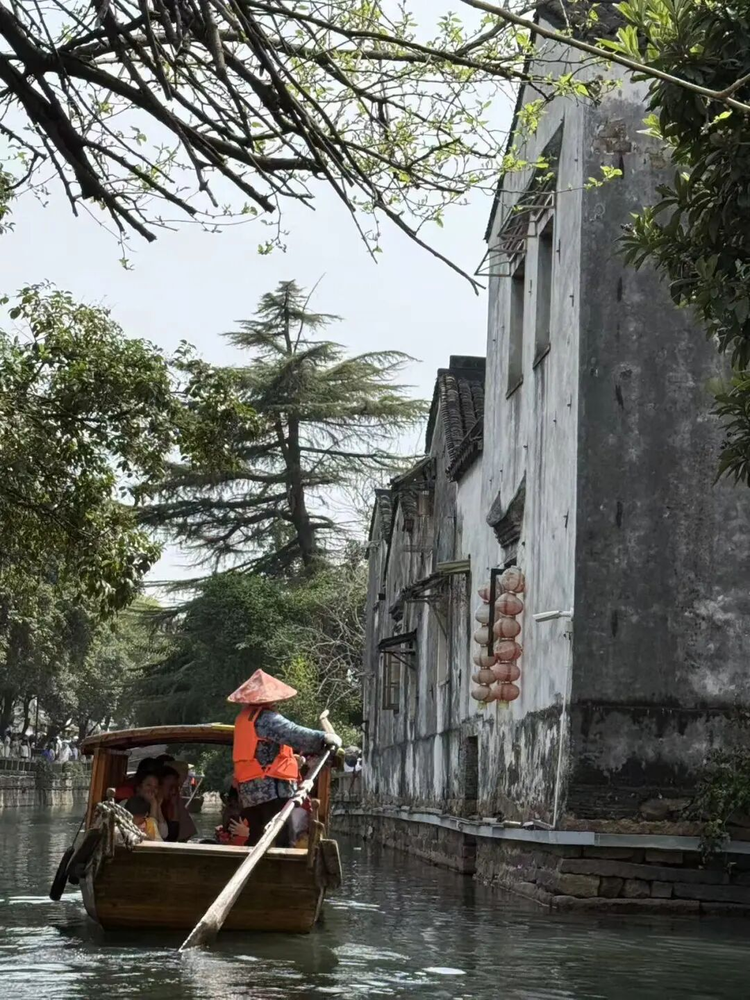

一枚房产小中介

【专业、诚实、便宜】

买卖咨询 15102382610
